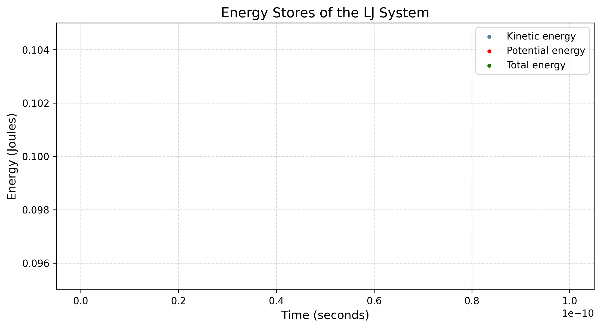

# 2D Lennard-Jones Molecular Dynamics Simulation

A 2D Molecular Dynamics (MD) simulation written in C to model an Argon gas/liquid system, coupled with a Python analysis and visualisation pipeline. 

The simulation computes atomic interactions using the empirical Lennard-Jones potential and integrates the classical equations of motion using the Velocity Verlet algorithm.

---

## Physics & Methodology

The particles interact via the classic pairwise Lennard-Jones 12-6 potential, which models the balance between strong Pauli repulsion at short distances and weak van der Waals attraction at long distances:

$$V(r) = 4\varepsilon \left[ \left(\frac{\sigma}{r}\right)^{12} - \left(\frac{\sigma}{r}\right)^6 \right]$$

### Key System Parameters:
* **Target Substance:** Argon ($\sigma = 0.34$ nm, $\varepsilon = 1.65 \times 10^{-21}$ J)
* **Ensemble:** Microcanonical ($NVE$) - constant number of particles, volume, and total energy.
* **Integrator:** Velocity Verlet. This symplectic integrator preserves phase space volume and ensures long-term energy conservation without systemic drift.

---

## Project Structure

* `LJ_Potential.c` - High-performance core physics engine. Computes pairwise forces, handles boundary conditions, and integrates particle positions and velocities.
* `LJ_plot.py` - Python script reading output trajectories and rendering a 2D animation of the particles.
* `Energy_plot.py` - Data analysis script checking for thermodynamic energy conservation.
* `energy_plot.png` - Exported diagnostic plot showing kinetic, potential, and total energy of the sysem.
* `lj_simulation.gif` - Animation of the simulated physical system.

---

## Results

### 1. Particle Trajectories
The physical behavior of the simulated Argon atoms is animated below. The system demonstrates typical fluid behavior as particles bounce within the boundaries and collide according to their potential wells.


### 2. Conservation of Energy
The simulation tracks Kinetic Energy ($KE$), Potential Energy ($PE$), and Total Energy ($E_{\text{total}}$) over thousands of time steps to verify the physical validity of our numerical integration.



As expected for an $NVE$ ensemble integrated with the Velocity Verlet algorithm, the total energy (represented by the flat line) remains highly conserved despite massive, continuous exchanges between kinetic and potential energy.

---

## How to Compile & Run

### Prerequisites
You need a C compiler (like GCC) and Python 3 installed with `pandas` and `matplotlib`.

### 1. Run the Physics Engine (C)
Compile with optimisation flags for high performance:

```bash
gcc -O3 LJ_Potential.c -o simulate -lm
./simulate
```

### 2. Visualise and Analyse (Python)
To plot the energy conservation curves:
```bash
python Energy_plot.py
```

To render the live animation of the simulation:
```bash
python LJ_plot.py
```